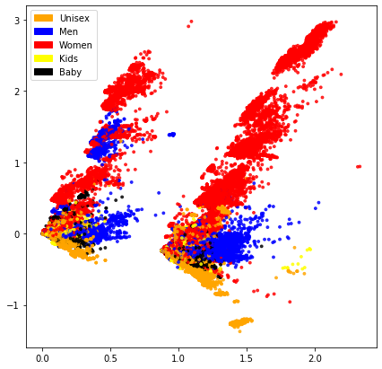
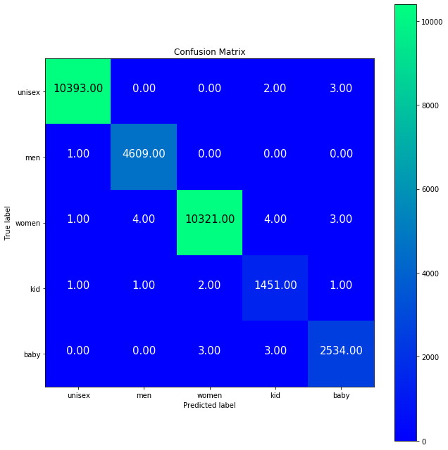

# Predict the Demographic of Products

In this project, we want to train a classifier to predict the target audience of a product, if the end consumer of a product is men, women, kids, baby or if it is unisex.
Our data include product information such as title, type, vendor name and product URL. 

The input of this project is a json file including different product information such as product title, product type. The output of this project is the list of products and their corresponding category.
In this repository, you will find a Jupiter notebook folder which include codes to perform preprocessing and labelling task.
Also, you fill find a script folder which contains python files to train and evaluate different machine learning process in this domain.


## Embedding

In NLP, a natural way to represent text to classifiers is to encode each word individually.
The simplest approach we can start with is to use a bag of words model. A bag of words associates an index to each word in our vocabulary, and embeds each sentence as a list of 0s, with a 1 at each index corresponding to a word present in the sentence. Now let’s visualize created embedding by projecting it down to 2D and see if we can identify some structure!





These embedding don't look very cleanly separated. Let's see how fitting a classifier can help.


## Fitting a Classifier


It’s always better to start with a simpler model rather than applying an unnecessary complicated and resource demanding models. 
After choosing our classifiers, we need to tune the parameters using our validation data set. We use Hyperopt in this project. After that, we train Logistic Regression and evaluate our model using test data set. By doing so, we obtained the following results:

#### Precision 	0.999      
#### Recall 		0.999   
#### F1 	   	    0.999  
#### Accuracy 	0.999




 

## Inspection
As we can see, our model is classifying almost perfectly. As you saw, we have used different data partitions to train, validate and test. We also have used different metrics such accuracy, precision, F_score and Recall and also the plotted confusion matrix verifies that products are classified correctly.


## So, Why Our Classifier is Doing Perfectly?

The answer is that our classifier learnt the keyword that our heuristic used for labelling our records. Hence, our model can perform well on the labeled records, but not that good on unlabeled records. Thus, in order to obtain the real performance of our model, we require label more records manually, and without our heuristics' help.
Do not forget that, we also need to add manually labeled records to our training data to improve the model performance!


### Update: we have added manually labelled records to validate and evaluate our models. Also, we used Random Forest and XGBoost. Please see the code to find out more! 


```python

```
